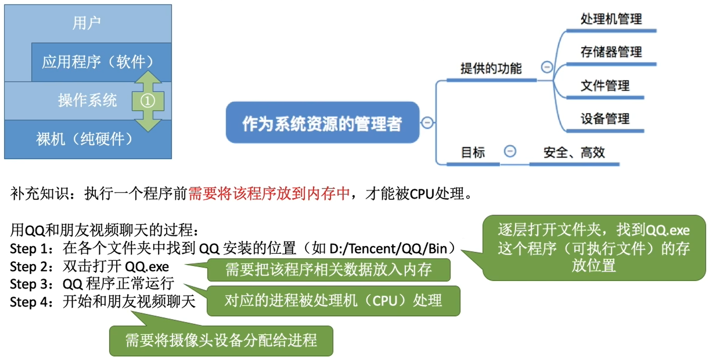
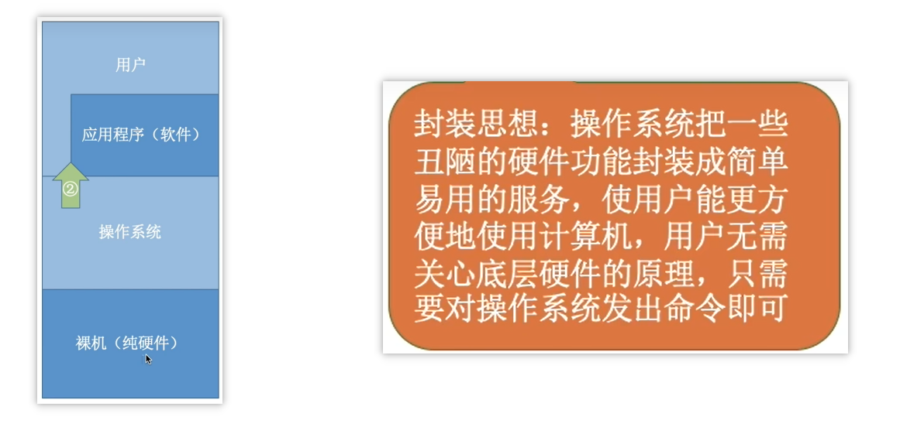
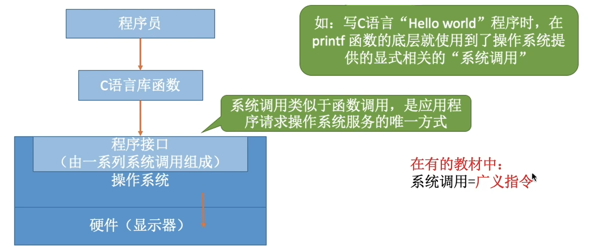
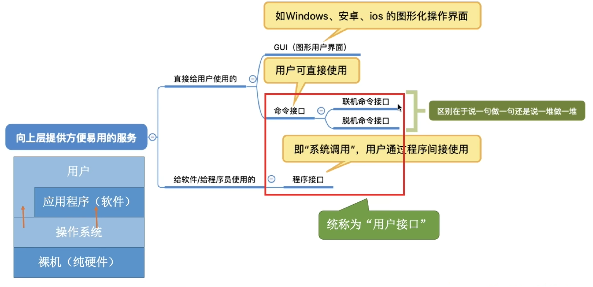
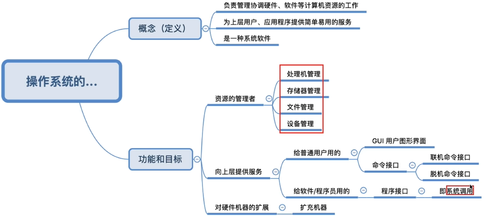

# 第一章：计算机系统概述

*@author Thuiww*

*@date 2025-02-25*

***

## 一、操作系统的概念&功能

### 1.1 概念介绍：

* 操作系统**定义**：指 <mark>控制和管理</mark> 整个计算机系统的 <mark>硬件和软件 </mark>资源，并合理地组织 <u>调度计算机的工作和资源分配</u>；以<u>提供给用户和其他软件方便的接口和环境</u>；<mark>操作系统是最基本的 **系统软件**</mark>。

### 1.2 功能与目标：

1. 作为系统资源的管理者：  
   

2. 向上层提供方便易用的服务：  
     如：  

   * **GUI**：图形化用户接口（Graphical User Interface）

   * **联机命令接口**（又称：交互式命令接口）：  
     如：windows系统下，进入cmd，用户说一句命令，系统跟着做一句命令

   * **脱机命令接口**（又称：批处理命令接口）：  
     如：windows系统下中的 `.bat `文件，用户将各个指令依次写入 `.bat` 文件，然后系统运行 `.bat` 文件按批次依次执行

   * **程序接口**：  
     可以在程序中进行<mark>系统调用</mark> 来使用程序接口   
     

       *<注意>：*普通用户不能直接使用程序接口，一般是程序员在编写应用程序时通过程序代码来间接使用

   * **<补充>: **关系图：  
     

3. 作为最接近硬件的层次：  

   * 没有任何软件支持的计算机被称为<mark>裸机</mark>。在裸机上安装操作系统，可以提供资源管理功能和方便用户的服务功能，将裸机改造成功能更强、使用更方便的机器。*（通常把覆盖了软件的机器称为扩充机器，又称为：<mark>**虚拟机**</mark>）* 
   * 操作系统是对硬件机器的扩展：将 CPU、内存、磁盘、显示器、键盘等硬件合理的组织起来，让各种硬件能够相互协调配合，实现更多的复杂功能。

### 1.3 总结： 

***

## 二、操作系统的特征

> 操作系统是一种 **系统软件**，但与其他系统软件和应用软件有很大的不同，它有着自己的特殊性（即 **基本特征**）。操作系统的基本特征包括***<mark>并发</mark>、<mark>共享</mark>、<mark>虚拟</mark>、<mark>异步</mark>。***

### 2.1 并发

* **“并发”** 与 **“并行”** 的区别：
  * 并发：指两个或多个事件在同一时间间隔内发生。这些事件**宏观上是同时发生**，但**微观上是交替发生**的。
  * 并行：指两个或多个事件在**同一时刻同时发生**。即**宏观微观均是同时发生**。
* **并发性**  
  操作系统并发性指的是计算机系统中“同时”*（宏观上同时）*运行着多个程序，这些程序宏观上是同时运行着的，而微观上看上去是交替运行的。
* <扩展>  
  * 操作系统是伴随着<mark>多道程序技术</mark>而出现的。因此，操作系统和程序并发是一起诞生的。
  * 单核CPU同一**时刻**只能执行一个程序，各个程序只能**并发**地执行；多核CPU同一**时刻**可以同时执行多个程序，多个程序可以并行的执行
    * 如：Intel的第八代i3处理器就是4核CPU，意味着可以并行地执行4个程序。
    * 即使是对于4核CPU来说，只要有4个以上的程序需要“同时”运行，那么并发性依然是必不可少的，因此**并发性是操作系统一个最基本的特性**。

### 2.2 共享

* 共享：即资源共享，是指系统中的资源可供内存中**多个并发执行的进程共同使用**
* 两种资源共享方式：
  * **互斥共享方式：**系统中的某些资源，虽然可以提供给多个进程使用，但一个时间段内只允许一个进程访问该资源  
    * 如：打印机、摄像头 等设备
  * **同时共享方式：**系统中的某些资源，允许一个时间段内由多个进程“同时”*（宏观上同时）*对它们进行访问
    * 如：内存中的程序进程“同时”访问硬盘资源..

### 2.3 虚拟

* 虚拟：操作系统的**虚拟特性**（Virtualization）是指通过软件手段，**把物理资源抽象成逻辑上的多个虚拟资源**，**使多个进程或用户可以共享这些资源，而不互相干扰。**可以把它理解成“让有限的资源看起来像是无限的”，或者“让不同进程或用户感觉自己独占资源”，从而提高计算机系统的效率和安全性。
  * **虚拟存储** ： 让程序以为有无限的内存（但实际上可能需要用磁盘补充）
  * **虚拟处理器** ：让每个进程以为自己独占 CPU（但实际上 CPU 轮流并发执行）
  * **虚拟设备** ：让多个程序可以共享硬件设备（但实际上 OS 在后台协调）
* 虚拟技术：
  * **空分复用技术**：  
    如：虚拟存储，物理内存被划分为多个页框，每个进程的虚拟地址空间映射到不同的页框，实现进程隔离
    * **📌 类比**：
      想象你的电脑是一个书架（物理内存），你有很多书（数据），但书架空间有限。你可以把不常看的书放进储藏室（磁盘），等需要时再拿出来。
      就如在4G内存电脑上可以同时运行需要4G内存的游戏和需要2G内存的社交软件。操作系统会采取 **虚拟存储技术** 进行**地址映射**和**内存换页**，让游戏和社交软件都“感觉”自己有足够的内存，即使物理内存不足。只不过它们实际上在磁盘和内存之间不断换页。 但如果换页过于频繁，会导致页面抖动（Thrashing），影响性能。
  * **时分复用技术：**  
    将**物理资源按照时间划分**，让多个进程轮流使用相同的资源，每个进程在某个时间片内独占资源。典型应用：虚拟处理器，通过时间片轮转或抢占调度，让多个进程轮流执行，每个进程感觉自己在独占CPU

### 2.4 异步

* **同步**与**异步**：
  * 同步（Synchronous）：同步操作在计算机中是指：同步操作的应用进程，要求在一个任务完成之前，另一个任务不能开始。换句话说，当任务A正在执行时，任务B必须等待任务A完成后才能开始。
  * 异步（Asychronous）：异步操作在计算机中是指：异步操作的应用进程，允许一个任务在执行时不需要等待其他任务完成。也就是说，任务B可以在没有等待任务A完成的情况下开始执行。
* 同步与异步**区别**：   
  如：好比去餐馆吃饭：
  * 在同步的情况下，厨师会等待你吃完一道菜之后，才能开始做下一道菜。这就好比是任务之间有一个明确的依赖关系，后一个任务必须等待前一个任务完成。这是一个**线性**的、依次执行的过程。
  * 而在异步的情况下，你吃菜和厨师做菜是可以并行进行的，你吃完一口菜并不影响厨师继续准备下一道菜，任务之间没有直接的依赖关系。厨师可以在你吃菜的同时准备下一道菜，你们之间的操作互不干扰，达到了一种**并行**或**并发**的效果。

 
