# 第一章：计算机系统概述

*@author Thuiww*

*@date 2025-02-25*

*参考：王道操作系统*

***

## 一、操作系统的概念&功能

### 1.1 概念介绍：

* 操作系统**定义**：指 <mark>控制和管理</mark> 整个计算机系统的 <mark>硬件和软件 </mark>资源，并合理地组织 <u>调度计算机的工作和资源分配</u>；以<u>提供给用户和其他软件方便的接口和环境</u>；<mark>操作系统是最基本的 **系统软件**</mark>。

### 1.2 功能与目标：

1. 作为系统资源的管理者：  
   

2. 向上层提供方便易用的服务：  
     如：  

   * **GUI**：图形化用户接口（Graphical User Interface）

   * **联机命令接口**（又称：交互式命令接口）：  
     如：windows系统下，进入cmd，用户说一句命令，系统跟着做一句命令

   * **脱机命令接口**（又称：批处理命令接口）：  
     如：windows系统下中的 `.bat `文件，用户将各个指令依次写入 `.bat` 文件，然后系统运行 `.bat` 文件按批次依次执行

   * **程序接口**：  
     可以在程序中进行<mark>系统调用</mark> 来使用程序接口   
     

       *<注意>：*普通用户不能直接使用程序接口，一般是程序员在编写应用程序时通过程序代码来间接使用

   * **<补充>: **关系图：  
     

3. 作为最接近硬件的层次：  

   * 没有任何软件支持的计算机被称为<mark>裸机</mark>。在裸机上安装操作系统，可以提供资源管理功能和方便用户的服务功能，将裸机改造成功能更强、使用更方便的机器。*（通常把覆盖了软件的机器称为扩充机器，又称为：<mark>**虚拟机**</mark>）* 
   * 操作系统是对硬件机器的扩展：将 CPU、内存、磁盘、显示器、键盘等硬件合理的组织起来，让各种硬件能够相互协调配合，实现更多的复杂功能。

### 1.3 总结： 

***

## 二、操作系统的特征

> 操作系统是一种 **系统软件**，但与其他系统软件和应用软件有很大的不同，它有着自己的特殊性（即 **基本特征**）。操作系统的基本特征包括***<mark>并发</mark>、<mark>共享</mark>、<mark>虚拟</mark>、<mark>异步</mark>。***

### 2.1 并发

* **“并发”** 与 **“并行”** 的区别：
  * 并发：指两个或多个事件在同一时间间隔内发生。这些事件**宏观上是同时发生**，但**微观上是交替发生**的。
  * 并行：指两个或多个事件在**同一时刻同时发生**。即**宏观微观均是同时发生**。
* **并发性**  
  操作系统并发性指的是计算机系统中“同时”*（宏观上同时）*运行着多个程序，这些程序宏观上是同时运行着的，而微观上看上去是交替运行的。
* <扩展>  
  * 操作系统是伴随着<mark>多道程序技术</mark>而出现的。因此，操作系统和程序并发是一起诞生的。
  * 单核CPU同一**时刻**只能执行一个程序，各个程序只能**并发**地执行；多核CPU同一**时刻**可以同时执行多个程序，多个程序可以并行的执行
    * 如：Intel的第八代i3处理器就是4核CPU，意味着可以并行地执行4个程序。
    * 即使是对于4核CPU来说，只要有4个以上的程序需要“同时”运行，那么并发性依然是必不可少的，因此**并发性是操作系统一个最基本的特性**。

### 2.2 共享

* 共享：即资源共享，是指系统中的资源可供内存中**多个并发执行的进程共同使用**
* 两种资源共享方式：
  * **互斥共享方式：**系统中的某些资源，虽然可以提供给多个进程使用，但一个时间段内只允许一个进程访问该资源  
    * 如：打印机、摄像头 等设备
  * **同时共享方式：**系统中的某些资源，允许一个时间段内由多个进程“同时”*（宏观上同时）*对它们进行访问
    * 如：内存中的程序进程“同时”访问硬盘资源..

### 2.3 虚拟

* 虚拟：操作系统的**虚拟特性**（Virtualization）是指通过软件手段，**把物理资源抽象成逻辑上的多个虚拟资源**，**使多个进程或用户可以共享这些资源，而不互相干扰。**可以把它理解成“让有限的资源看起来像是无限的”，或者“让不同进程或用户感觉自己独占资源”，从而提高计算机系统的效率和安全性。
  * **虚拟存储** ： 让程序以为有无限的内存（但实际上可能需要用磁盘补充）
  * **虚拟处理器** ：让每个进程以为自己独占 CPU（但实际上 CPU 轮流并发执行）
  * **虚拟设备** ：让多个程序可以共享硬件设备（但实际上 OS 在后台协调）
* 虚拟技术：
  * **空分复用技术**：  
    如：虚拟存储，物理内存被划分为多个页框，每个进程的虚拟地址空间映射到不同的页框，实现进程隔离
    * **📌 类比**：
      想象你的电脑是一个书架（物理内存），你有很多书（数据），但书架空间有限。你可以把不常看的书放进储藏室（磁盘），等需要时再拿出来。
      就如在4G内存电脑上可以同时运行需要4G内存的游戏和需要2G内存的社交软件。操作系统会采取 **虚拟存储技术** 进行**地址映射**和**内存换页**，让游戏和社交软件都“感觉”自己有足够的内存，即使物理内存不足。只不过它们实际上在磁盘和内存之间不断换页。 但如果换页过于频繁，会导致页面抖动（Thrashing），影响性能。
  * **时分复用技术：**  
    将**物理资源按照时间划分**，让多个进程轮流使用相同的资源，每个进程在某个时间片内独占资源。典型应用：虚拟处理器，通过时间片轮转或抢占调度，让多个进程轮流执行，每个进程感觉自己在独占CPU

### 2.4 异步

* **同步**与**异步**：
  * 同步（Synchronous）：同步操作在计算机中是指：同步操作的应用进程，要求在一个任务完成之前，另一个任务不能开始。换句话说，当任务A正在执行时，任务B必须等待任务A完成后才能开始。
  * 异步（Asychronous）：异步操作在计算机中是指：异步操作的应用进程，允许一个任务在执行时不需要等待其他任务完成。也就是说，任务B可以在没有等待任务A完成的情况下开始执行。
* 同步与异步**区别**：   
  如：好比去餐馆吃饭：
  * 在同步的情况下，厨师会等待你吃完一道菜之后，才能开始做下一道菜。这就好比是任务之间有一个明确的依赖关系，后一个任务必须等待前一个任务完成。这是一个**线性**的、依次执行的过程。
  * 而在异步的情况下，你吃菜和厨师做菜是可以并行进行的，你吃完一口菜并不影响厨师继续准备下一道菜，任务之间没有直接的依赖关系。厨师可以在你吃菜的同时准备下一道菜，你们之间的操作互不干扰，达到了一种**并行**或**并发**的效果。

### 2.5 总结

* **并发** 与 共享、虚拟、异步 的关系：
  * 并发与共享的关系：并发与共享互为存在条件。如果没有并发，那么共享则失去了存在的意义；如果没有共享，那么并发就无法实现
  * 并发与虚拟的关系：如果失去了并发性，则一个时间段内系统只能运行一道程序，那么就失去了实现虚拟性的意义。因此，没有并发性，就谈不上虚拟性。
  * 并发与异步的关系：如果失去了并发性，即系统只能串行地运行各个程序，那么每个程序的执行会一贯到底。只有系统拥有并发性，才会有可能产生异步性
* 总结：  
  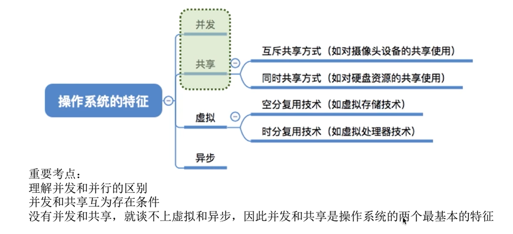

***

## 三、操作系统的发展和分类

> 操作系统的**发展**和**分类**：
>
> 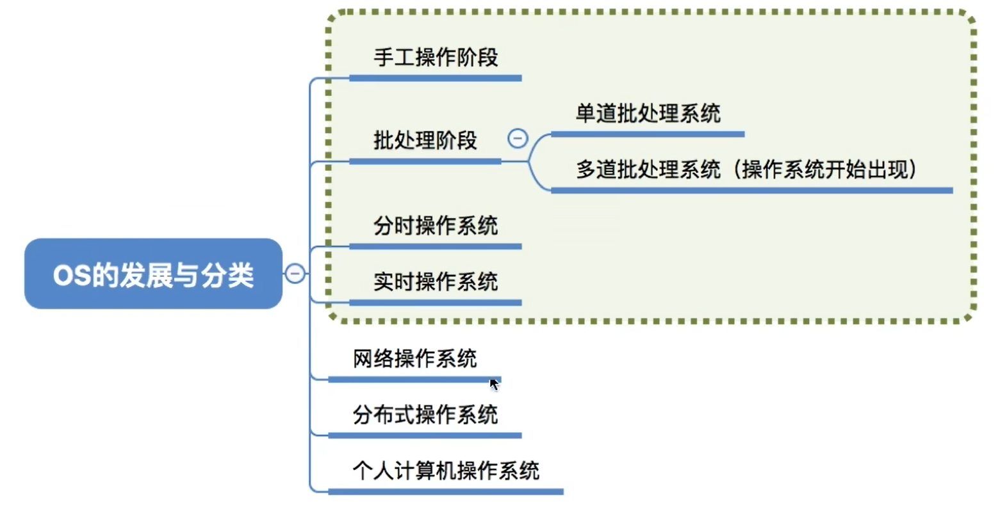
> ***<注意>***：操作系统是从 **多道批处理系统** 开始出现的！！

### 3.1 <mark>手工操作阶段</mark>

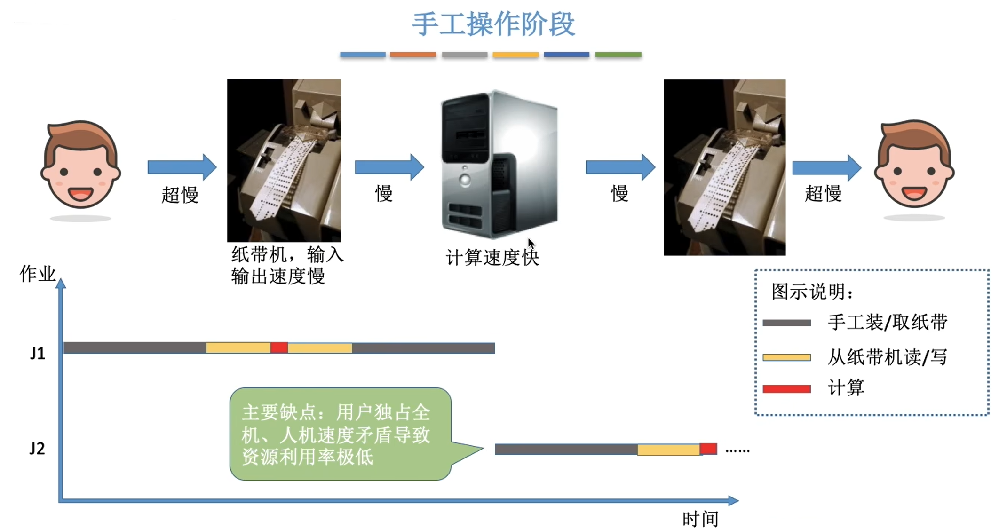

### 3.2 批处理阶段<small>（单道批处理系统 和 多道批处理系统）</small>：

* <mark>**单道批处理系统：**</mark>   
  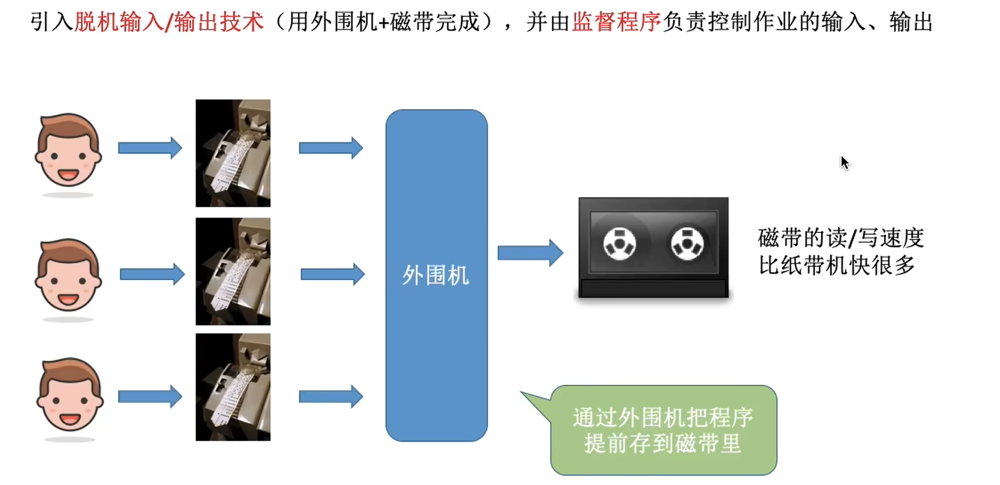  
  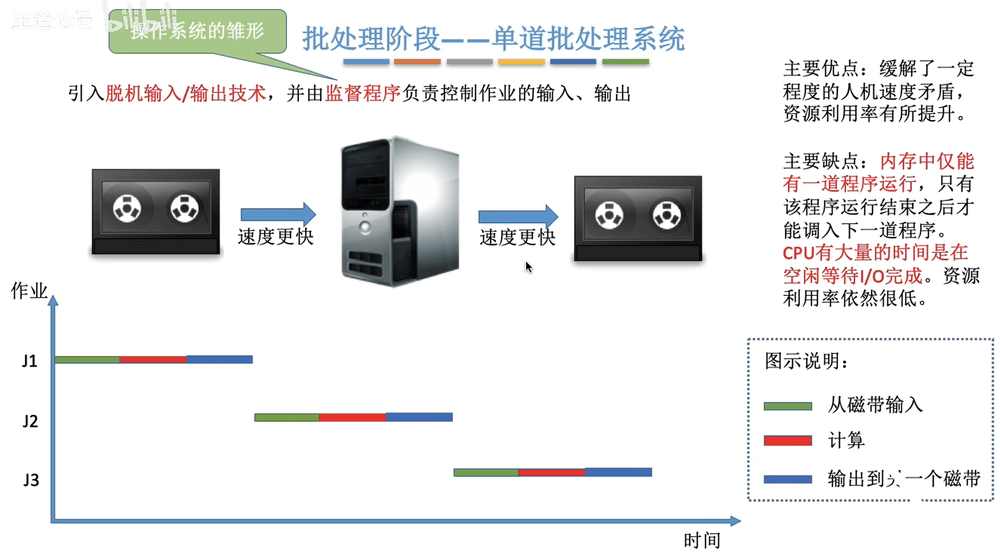

* <mark>**多道批处理系统：**</mark>  
  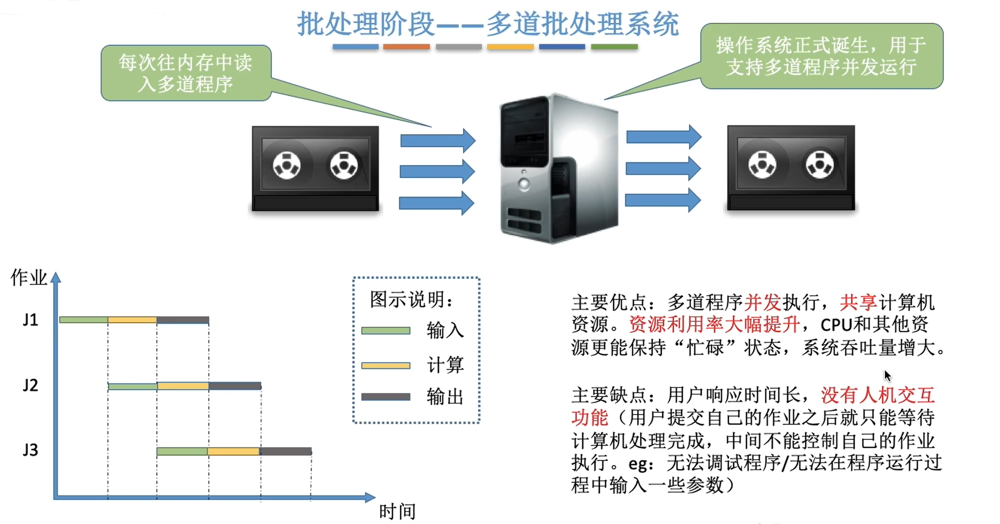

###  3.3 <mark>分时操作系统：</mark>
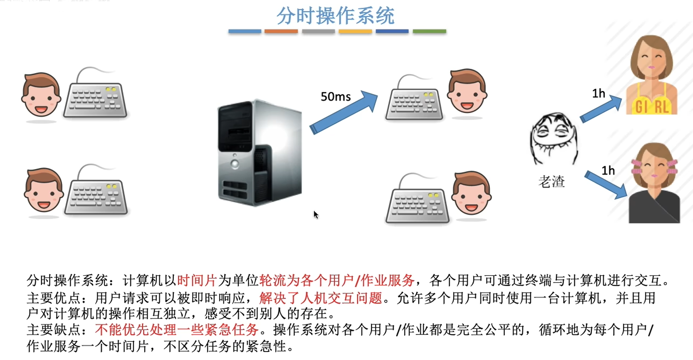

### 3.4 <mark>实时操作系统： </mark>

* 硬实时系统
* 软实时系统

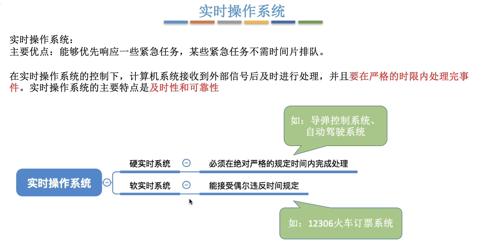

### 3.5 其他几种操作系统：

* <mark>**网络操作系统**</mark>： 伴随着计算机网络的发展而诞生，能把网络中各个计算机有机的结合起来，实现数据传送等功能，实现网络中总各种资源的共享（如：文件共享）和各台计算机之间通信。(如：Windows NT)
* <mark>**分布式操作系统**</mark>：主要特点是分布性和并行性。系统中各台计算机地位相同，任何工作都可以分布在这些计算机上， 由它们并行、协同完成这个任务
* **<mark>个人计算机系统</mark>**：如 Windows XP、MacOS，方便个人使用

### 3.6 总结：

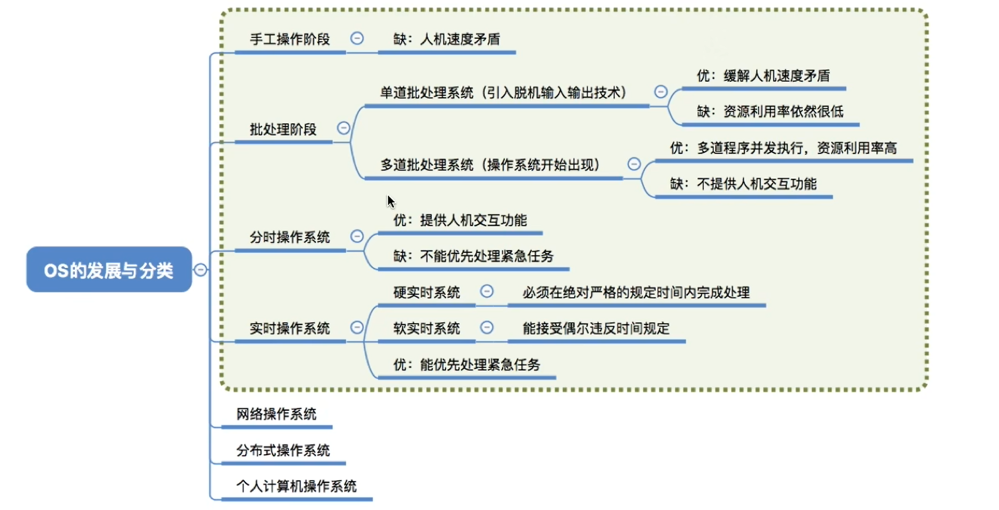

***

## 四、操作系统的运行机制

> ***预备知识：***（程序是如何运行的？）  
>
> * 以C语言为例，C语言代码通过编译器编译，由高级语言的代码翻译为多条二进制的机器指令，最终交给CPU进行执行  
>   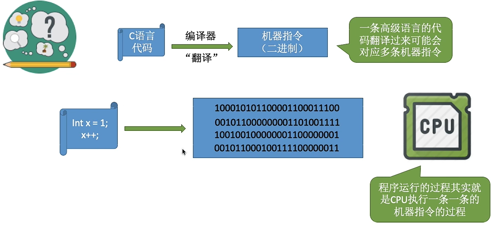
> * <注意>：这里的 “指令” 是指CPU能够识别、执行的最基本的命令。  
>   （这里的“指令”并不是Windows、Linux 小黑框中的那些命令）

### 4.1.什么是 内核程序 和 应用程序

* **内核程序**：负责实现操作系统内核，即：**操作系统内核**（简称：内核（Kernel））由内核程序构成。
  * 内核是操作系统最重要最核心的部分，也是最接近硬件的部分。
  * 甚至可以说：一个操作系统只要有内核就够了（例如：Docker容器实现运行Linux系统 ->仅需Linux内核），操作系统的功能未必都在内核之中，如图形化用户界面GUI
* **应用程序**：作为普通程序员写的程序就是“应用程序”，如 QQ、WeChat、Chrome等等。对于内核程序都是如微软（Windows）、苹果（MacOS、IOS）的一帮人负责实现的操作系统

### 4.2 什么是 特权指令 和 非特权指令

> **<补充>**：  
> 在让CPU执行指令运行程序时，分为**特权指令**和**非特权指令**，CPU可以区分当前正在执行的指令是特权指令还是非特权指令。

* **特权指令**：特权指令具有着较为高的权限，当普通应用程序想要运行时，可能面临着高额风险，所以特权指令只运行操作系统的内核来命令CPU来执行
* **非特权指令**：除特权指令以外的指令，即：普通指令，就是普通程序进程一般的执行指令

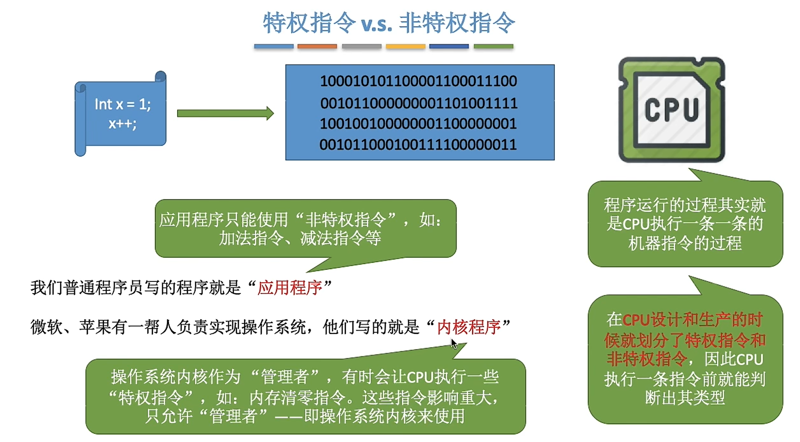

### 4.3 什么是 内核态 和 用户态

> **<扩展>**：  
> CPU运行时的两种状态：**内核态** 和 **用户态**。

* **内核态**：当CPU处于内核态状态下，说明此时正在运行的程序为：**内核程序**，此时<mark>可以执行特权指令</mark>
* **用户态**：当CPU处于用户态状态下，说明此时正在运行的程序为：**应用程序**，此时<mark>只能执行非特权指令</mark>

#### 问题一：CPU既然能判断指令的类型，但是如何区分当前正在运行的是内核程序还是应用程序呢？

* 答：CPU中有一个寄存器叫做<mark>**程序状态寄存器（PSW）**</mark>，其中有个二进制位，1表示“内核态”，0表示“用户态”（这里的“0”，“1”表示的状态并不是一定，根据CPU的不同而不同）

#### 问题二：内核态和用户态如何切换？

* **内核态->用户态**：执行一条**<mark>特权指令</mark>**——<mark>修改PSW标志位</mark>变为“用户态”，这个动作意味着操作系统主动让出CPU使用权
* **用户态->内核态**：由**<mark>“中断”</mark>**引发，<mark>硬件自动完成变态的过程</mark>，触发中断信号意味着操作系统将强行夺回CPU使用权
  * 如何引发**“中断”**：除了应用程序非法使用特权指令之外，还有很多事件会触发中断信号。一个共性是：**但凡需要操作系统介入的地方，都会触发中断信号**

 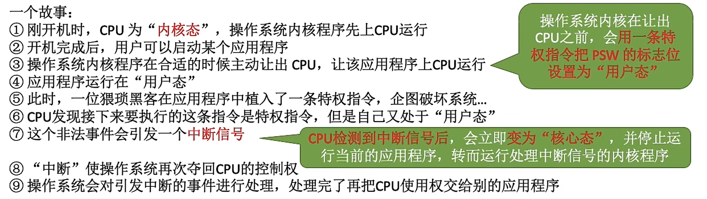

### 4.4 中断和异常：

#### 4.4.1 什么是中断？

* **中断**是<mark>让**操作系统内核**夺回**CPU**使用权</mark>的**唯一**途径
* 中断的作用：
  * 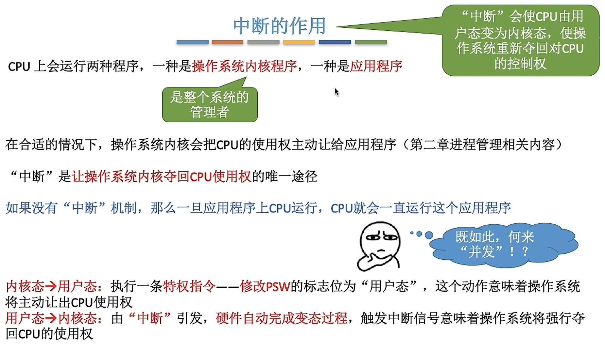

#### 4.4.2 中断的类型：

* **内中断（异常）**：与当前执行的指令**有关**，中断信号来源于**CPU内部**

  * **陷入异常（陷阱 trap）**：由陷入指令引发，是应用程序故意引发的
    * 如：当前进程若要使用**系统调用**来访问共享资源（如：打印机等I/O设备）时，当前进程就会让CPU执行陷入指令<mark>**（注意：陷入指令是非特权指令）**</mark>，发生内中断，由用户态转为核心态，然后执行相关系统调用服务
  * **故障异常（fault）**：由错误条件引起的，可能被内核程序修复。内核程序修复故障后会把CPU使用权还给应用程序，让它继续执行下去。
    * 如：缺页故障异常
  * **终止异常（abort）**：由致命错误引起，内核程序无法修复改错误，因此一般不再将CPU使用权还给引发终止的应用程序，而是直接终止该应用程序。
    * 如：整数除以 0，非法使用特权指令
  * 一些例子：  
    

* **外中断**：与当前执行的指令**无关**，中断信号来源于**CPU外部**

  * <mark>CPU在每一条指令执行结束之后都会例行的检查是否有外部中断信号</mark>，这里检查的就是外部中断信号，如：

    * *例子1：时钟中断*  

    * 例子2：I/O中断：由输入/输出设备向CPU发出的中断信号，**由设备控制器（外部硬件）向CPU发送的**，因此 I/O 中断属于 **外中断**，而不是 CPU 内部异常

      * **示例 1：键盘输入**
        1. 用户按下键盘，键盘控制器会**生成 I/O 中断**。
        2. CPU 接收到**键盘中断请求**，暂停当前任务，跳转到**中断服务程序（ISR）**读取键盘输入数据。
        3. 处理完键盘输入后，CPU 继续执行原来的任务。

      * **示例 2：磁盘读取完成**
        1. 进程向磁盘请求读取文件，磁盘控制器开始读取数据。
        2. 读取完成后，磁盘控制器发送**I/O 完成中断**给 CPU。
        3. CPU 响应中断，将数据传输到内存，并通知进程读取完成。

> <mark>**内中断 **和 **外中断 **的举例：（进程进行磁盘读取）</mark>
>
> 以 **磁盘读取** 为例，看看进程执行 I/O 操作和 I/O设备执行I/O 中断是如何配合的：
>
> 1️⃣ **进程发起 I/O 请求**
>
> - 进程调用 `read(fd, buffer, 100);` 触发 **陷入异常（Trap）**（内中断），请求操作系统执行系统调用读取磁盘数据。
>
> 2️⃣ **OS 发送 I/O 请求给磁盘**
>
> - OS 发现数据**不在内存**，于是向磁盘控制器发送**DMA（直接内存访问）请求**。
>
> 3️⃣ **进程进入阻塞状态**
>
> - 由于 I/O 操作**需要时间**，进程**进入阻塞状态**，OS **切换到其他进程运行**。
>
> 4️⃣ **磁盘读取完成，触发 I/O 中断**（外中断）
>
> - 磁盘控制器完成数据传输后，**触发 I/O 中断**，通知 CPU **数据已经准备好**。
>
> 5️⃣ **CPU 处理中断**
>
> - CPU **暂停当前任务**，调用 **中断服务程序（ISR）** 处理 I/O 结果，把数据存入进程缓冲区。
>
> 6️⃣ **唤醒进程**
>
> - OS 让等待 I/O 的进程**从阻塞状态变为就绪状态**，等待 CPU 调度执行。
>
> 7️⃣ **进程继续执行**
>
> - `read()` 返回数据，进程继续运行。

#### 4.4.3 中断基本原理：

* 不同的中断信号，需要用不同的中断处理程序来处理。当CPU检测到中断信号后，会根据中断信号的类型去查询<mark>“中断向量表”</mark>，以此来找到相应的中断处理程序在内存中存放的位置。  
  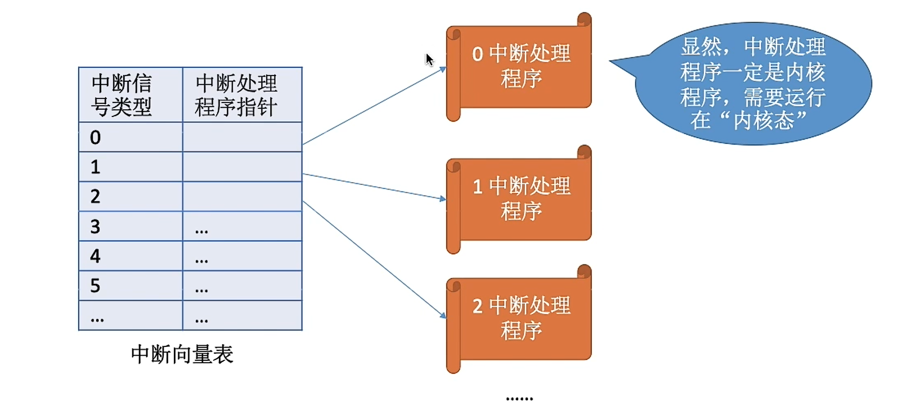

### 4.5 系统调用：

#### 4.5.1 什么是系统调用？

> 操作系统会向上给 **用户** 和 **应用程序** 提供相应的接口。**系统调用（System Call）** 是操作系统提供<mark>给 **应用程序（程序员）** 使用的接口</mark>，它允许用户态的进程请求操作系统内核执行特定的服务（如文件操作、进程管理、I/O 设备访问等）。
>
> 通常，程序员并不直接编写系统调用，而是使用 **标准库函数（如 C 语言的 `printf()`、`open()`、`read()` 等）**，这些库函数内部会封装 **系统调用**，从而让应用程序能够方便地请求操作系统提供的服务。  
> *（不是“所有”系统调用都被封装进库函数，部分程序可以直接使用 **`syscall()`** 或内联汇编调用系统调用。）*
>
> 当应用程序执行系统调用时，CPU 会触发 <mark>**陷入异常（Trap）**（非特权指令）</mark>，导致程序从 **用户态（User Mode）** 切换到 **内核态（Kernel Mode）**，由操作系统内核执行相应的系统调用服务，完成操作后再切换回用户态，继续执行应用程序的代码。

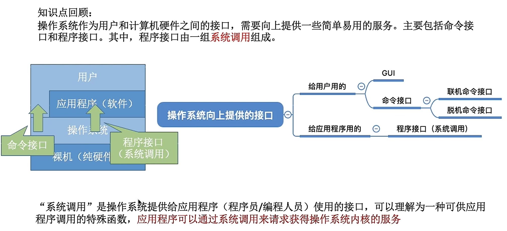

* 给**用户**提供：
  * GUI
  * 命令接口
* 给**应用程序**提供：
  * 程序接口（<mark>系统调用</mark>）

***<补充>***：**系统调用** 与 **库函数** 的区别：  

（不是“所有”系统调用都被封装进库函数，部分程序可以直接使用 **`syscall()`** 或内联汇编调用系统调用。）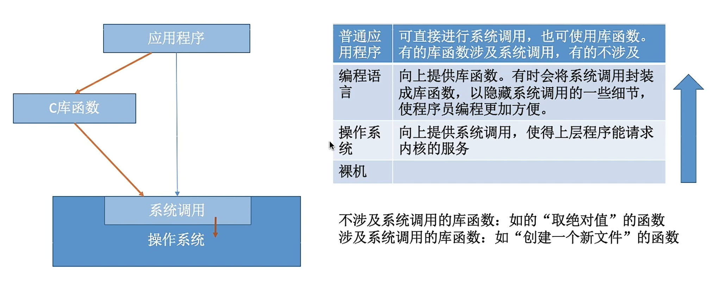

#### 4.5.2 为什么系统调用是必须的？

* *<示例>：*
  * **问题**：当两个进程A, B 想要同时访问打印机资源 P 时（A想打印：aaaaa，B想打印：bbb），如果操作系统不对这两个进程进行干预和限制，任由两个进程A, B去访问打印机资源 P并对自己的内容进行输出打印，那么就可能出现 aabbababa等交叉打印的错误情况。
  * **解决**：所以，**操作系统**必须将这些共享资源交给操作系统内核进行统一的管理，进程之间的相互访问必须经过操作系统内核管理和安排，有秩序的进行。因此，操作系统内核便向应用程序提供了“系统调用”，当用户进程想要使用打印机这种共享资源，只能通过系统调用向操作系统内核发出请求。内核会对各个请求进行协调处理。

#### 4.5.3 什么功能要用到系统调用？

> 应用程序通过**系统调用**请求操作系统的服务。而系统中的各种共享资源都由操作系统内核统一掌管，因此<mark>凡是与共享资源有关的操作*（如：存储分配、I/O操作、文件管理等）*</mark>，都必须通过系统调用的方式向操作系统内核提出服务请求，由操作系统内核代为完成。这样可以保证系统的稳定性和安全性，防止用户进行非法操作。

***系统调用（按功能分类）***:

* **设备管理：**完成设备的 请求、释放、启动 等功能
* **文件管理：**完成文件的 读、写、创建、删除 等功能
* **进程控制：**完成进程的 创建、撤销、阻塞、唤醒 等功能
* **进程通信：**完成进程之间的 消息传递、信号传递 等功能
* **内存管理：**完成内存的 分配、回收 等功能

#### 4.5.4 系统调用的过程：

***以一个应用程序正在CPU上运行为例：***

* 当前应用进程并不需要进行系统调用，正在执行一些其他的指令：  
  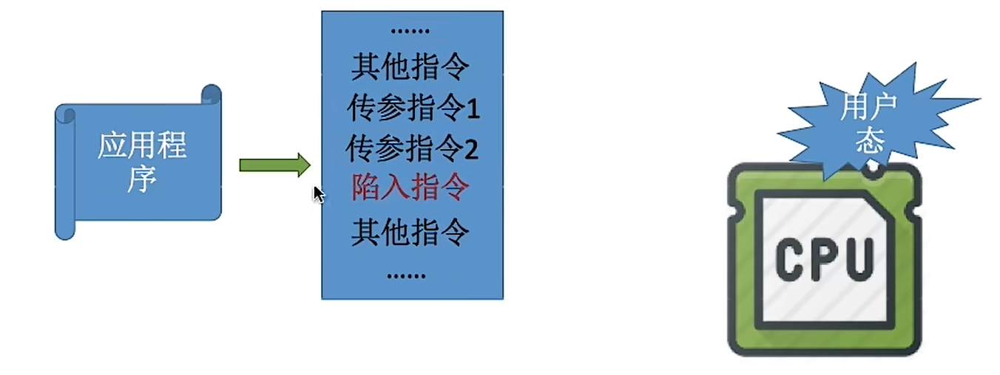
* 当进程想要使用某些系统调用服务时，开始执行需要系统调用的相关指令，首先是先进行传参，这些参数主要包括为让操作系统去执行哪种的系统调用服务，以及其他的相关参数：   
  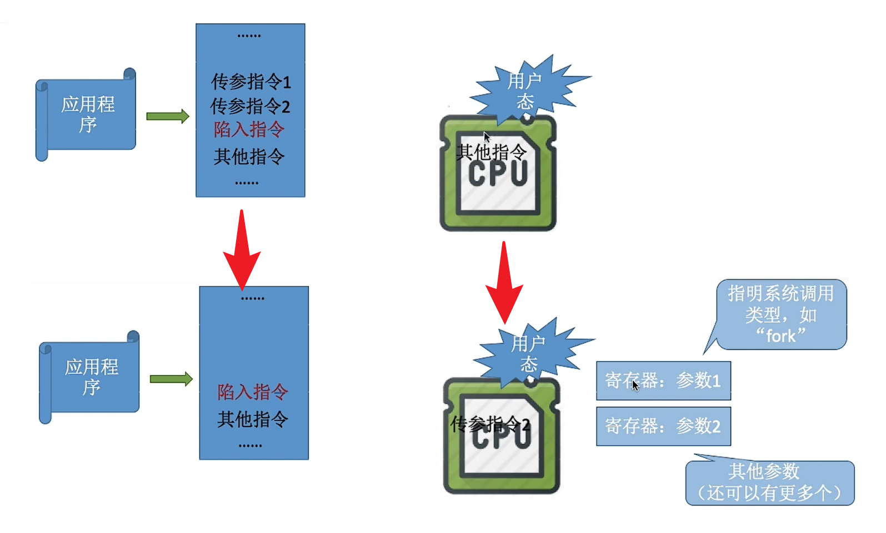
* 当想要请求的系统调用服务的相关参数放入CPU的相关寄存器中时，这时应用程序会执行**陷入指令（非特权指令）**，主动引发内中断  
  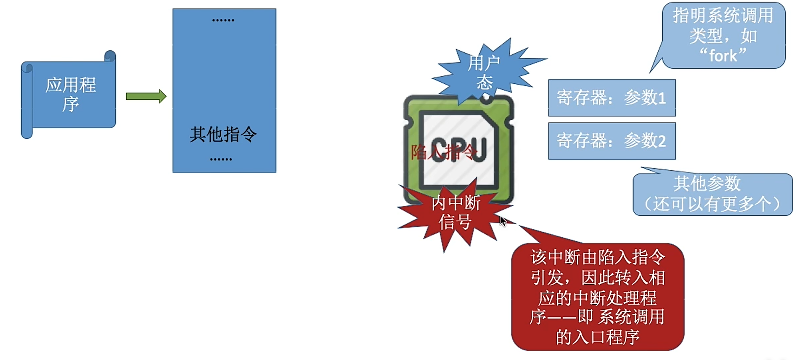
* CPU由**用户态切换为内核态**，根据之前存入在相关寄存器的数据，为当前进程相应相关的系统服务  
  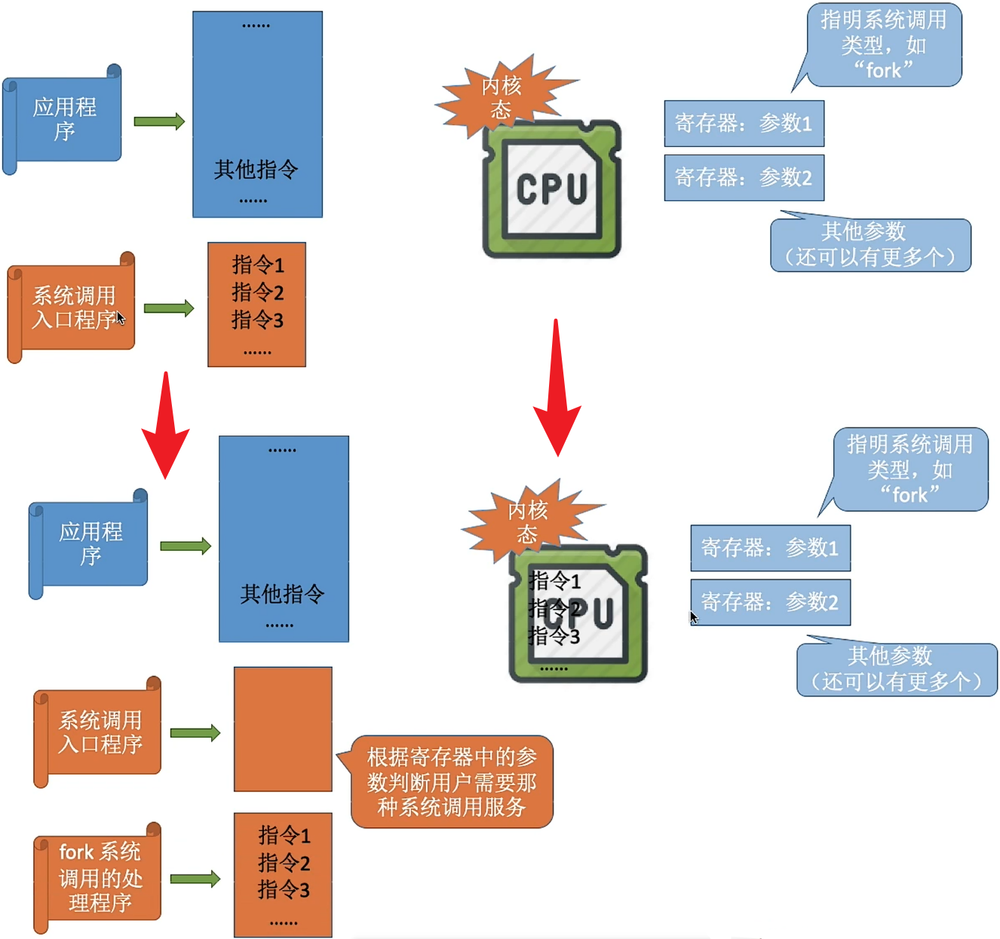
* 最后当系统处理完该进程请求的系统服务时，会由CPU自动将**内核态转为用户态**，然后执行该进程之后的相关指令：  
  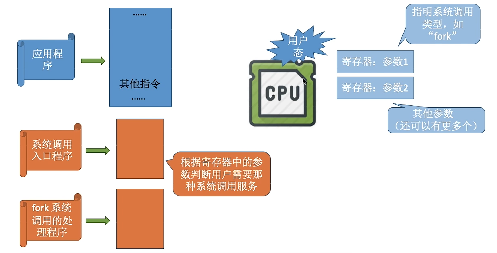

***<big><补充>:</big>***

> <big>**代码的角度展示系统调用的过程：**</big>
>
> 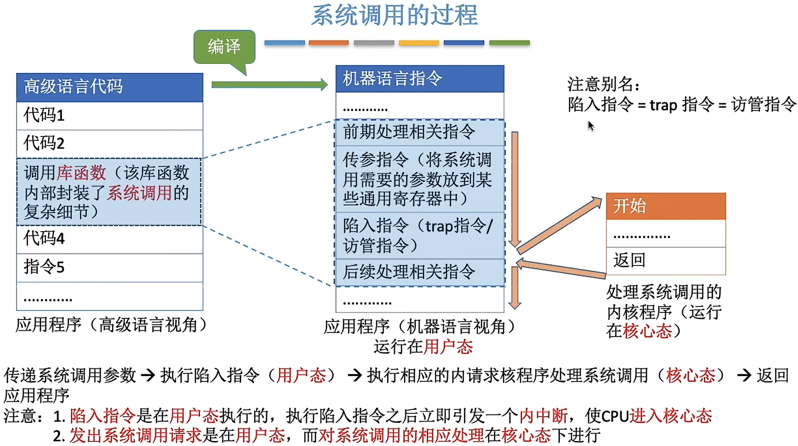

***

## 五、操作系统的体系结构

### **5.1 操作系统与操作系统内核**

#### **🔹 什么是操作系统内核？**

- **内核（Kernel）** 是操作系统最核心的部分，负责直接管理 **硬件资源** 并提供 **基本服务**，如进程管理、内存管理、设备管理等。
- 运行在 **内核态**，拥有最高的权限，能够直接操作 **CPU、内存、设备**。

#### **🔹 内核的关键模块**

✅ **与硬件紧密相关的模块（必须具备）**

- **时钟管理**：负责定时中断、进程调度、时间片管理。

- **中断处理**：实现 I/O 设备中断、异常处理等。

- 原语（Primitive）

  ：

  - **最底层的程序**，直接控制硬件。
  - **具备原子性**（不可被中断）。
  - **执行时间短，调用频繁**。

✅ **对系统资源进行管理的模块（部分OS内核中没有，如：微内核）**

- **进程管理**：负责进程创建、调度、同步、通信等。
- **存储器管理**：管理内存分配、回收、虚拟内存等。
- **设备管理**：管理磁盘、打印机、键盘等外部设备的访问权限和调度。

> **内核**是操作系统最基本、最核心的部分。实现操作系统内核功能的那些程序就是内核程序
>
>   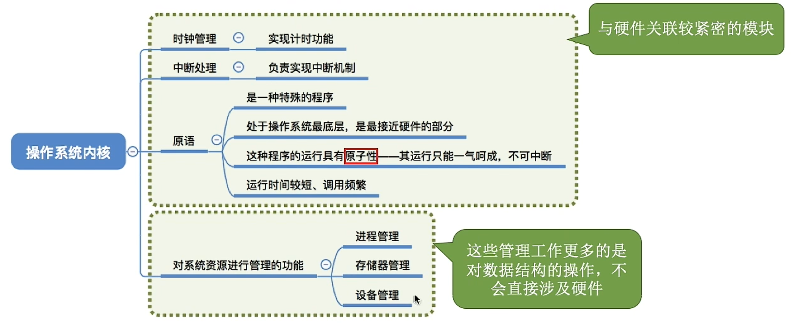
>
> 这里<mark>**与硬件关联较紧密的模块**</mark>：***时钟管理**、**中断处理**、**原语***，<mark>是操作系统内核必须具备的模块</mark>，对于**对系统资源进行管理的功能**：***进程管理**、**存储器管理**、**设备管理***，在某些内核结构中可能没有

📌 **补充：单体内核 vs 微内核**

| **类型**                                    | **特点**                                                 | **优缺点**                                                   |
| ------------------------------------------- | -------------------------------------------------------- | ------------------------------------------------------------ |
| **单体内核（大内核）（Monolithic Kernel）** | 所有核心功能都运行在内核态，直接管理硬件                 | **优点**：运行效率高；**缺点**：系统崩溃影响大，扩展性差     |
| **微内核（Microkernel）**                   | 仅保留基本功能，如进程管理、内存管理，其他功能移到用户态 | **优点**：安全性高，稳定性强；**缺点**：通信开销大，性能略低 |

#### **🔹 内核结构图**

* **内核结构**：（以大内核为例）  
  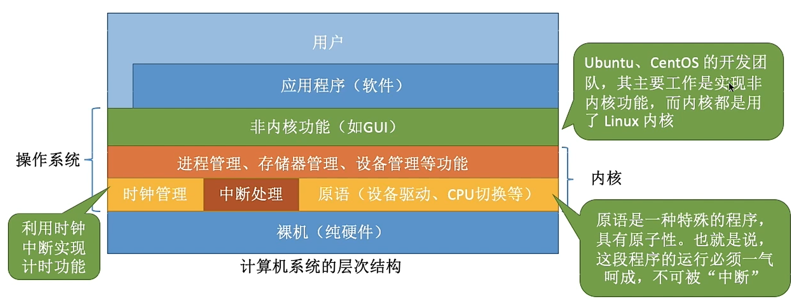

### 5.2 大内核 与 微内核

* **大内核** 与 **微内核 **结构图：  
  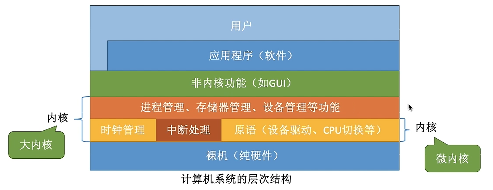

<mark>***<注意>***</mark>：操作系统**内核**需要运行在**内核态**，操作系统**非内核**功能运行在**用户态**。  
*正是因为这种特性，在选取**内核**种类时，会有不同的优缺点。*

* **大内核** 与 **微内核** 的差别：  
  * <mark>大内核</mark>:
    * 优点：高性能
    * 缺点：内核代码庞大，结构混乱，难以维护
  * <mark>微内核</mark>:
    * 优点：内核功能少，结构清晰，方便维护
    * 缺点：需要频繁地在核心态和用户态之间切换，性能低
* ***<示例>：***  
  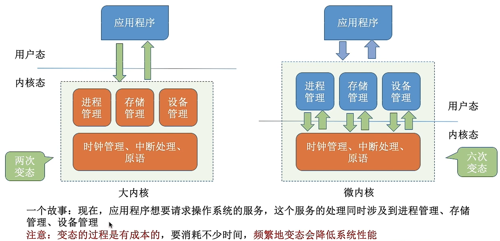

### 5.3 其他内核结构<small>（包含大内核和微内核）</small>：

#### **5.3.1 分层结构（Layered Architecture）**

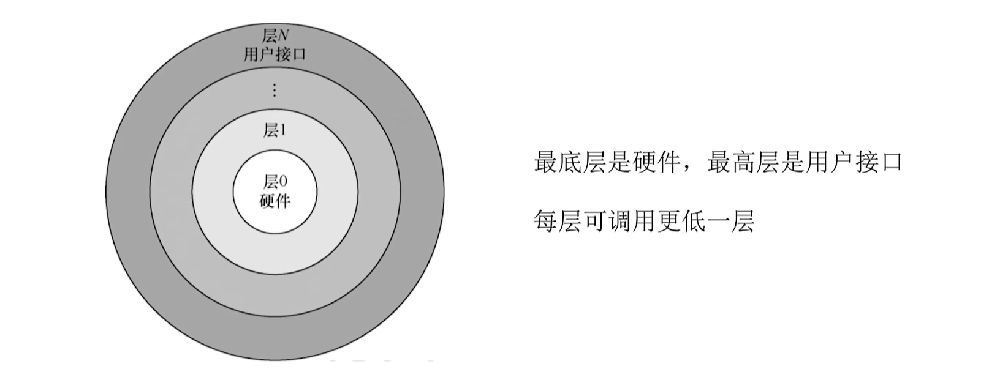

* **特点与思想**：
  - 内核被划分为多个层，每层只能调用更低一层提供的接口，形成严格的层次关系。

* **优点**： 
  * ✅ **易于测试与维护**：各层接口清晰，调试验证可以由底层向上递进进行。
  * ✅ **良好的扩展性**：层与层之间调用固定，方便后续新增功能或修改实现。

* **缺点**： 
  * ❌ **层次限制过于严格**：只能调用相邻层，可能导致层次划分不合理时难以优化系统性能。
  * ❌ **效率较低**：跨层调用成本较高，系统调用执行时间较长。

#### **5.3.2. 模块化（Modular Kernel）**

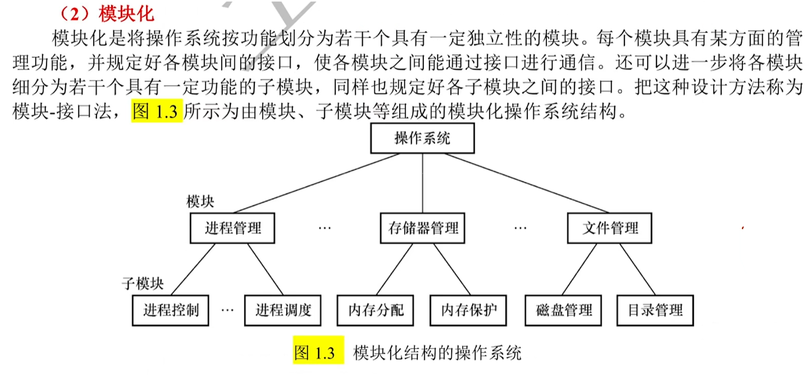

* **特点与思想**：

  - 内核被拆分为多个模块，各模块可以协作运行，并且可以动态加载或卸载某些模块。

  - **主模块（核心部分）**：仅包含最核心功能，如进程调度、内存管理等。

  - **可加载模块**：可以在不重新编译内核的情况下动态添加新功能，如设备驱动。

* **优点**： 

  * ✅ **易于维护**：模块间逻辑清晰，结构化设计使得维护更简单。
  * ✅ **高扩展性**：支持动态加载新模块，如设备驱动、文件系统等，提高OS适应性。
  * ✅ **高效**：模块可以直接调用其他模块，无需额外的通信机制。

* **缺点**： 
  * ❌ **模块间依赖复杂**：如果模块接口设计不合理，可能导致兼容性问题。
  * ❌ **测试和验证难度较大**：模块间相互依赖，确保所有模块兼容性较困难，测试覆盖全面性要求更高

#### **5.3.3 宏内核（Monolithic Kernel，大内核）**

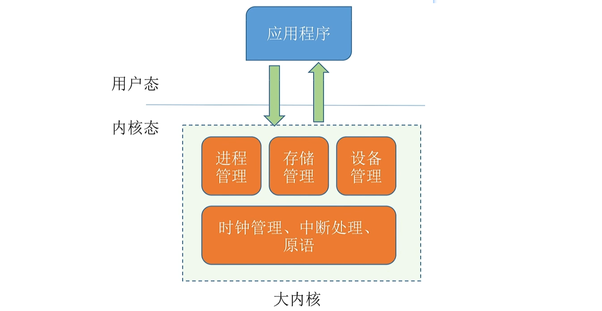

* **特点与思想**：

  - **所有系统功能均运行在内核态**，包括进程管理、内存管理、文件系统、设备驱动等。

  - 通常也采用一定的模块化设计思想，使部分功能可以动态加载。

* **优点**： 
  * ✅ **性能高**：所有功能运行在 **内核态**，不需要用户态与内核态的切换，减少性能开销。
  * ✅ **直接调用**：内核内部各模块可以直接互相调用，提高效率。

* **缺点**： 
  * ❌ **内核规模庞大**，难以维护，代码改动可能影响整个系统。
  * ❌ **稳定性较差**：某个内核模块崩溃，可能导致整个系统崩溃。

#### **5.3.4 微内核（Microkernel，小内核）**

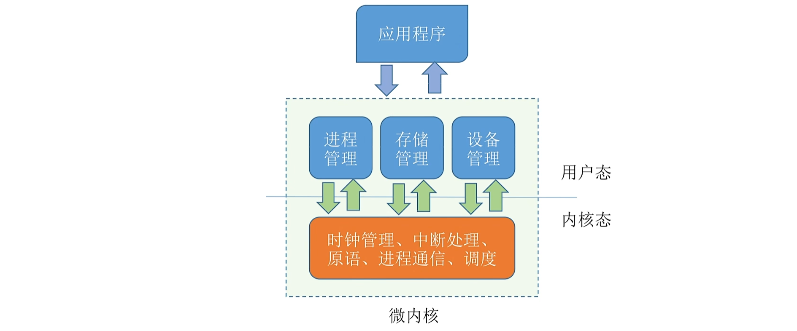

* **特点与思想**：

  - **仅保留最基础的功能在内核态**，如进程管理、内存管理、进程间通信（IPC），其他功能（如设备驱动、文件系统等）放在用户态运行。

  - 用户态组件通过消息传递方式（IPC）与内核通信。

* **优点**：
  *  ✅ **稳定性高**：用户态组件崩溃不会影响整个系统，增强系统可靠性。
  * ✅ **易扩展**：可以在不修改内核的情况下添加或修改新功能，提高灵活性。

* **缺点**： 
  * ❌ **性能较低**：由于频繁的用户态-内核态切换和消息传递，系统开销较大。（大量采用消息传递，导致性能开销较大）
  * ❌ **用户态模块之间不能直接调用**，只能通过内核的消息传递机制，增加了通信开销。

#### **5.3.5 外核（Exokernel）**

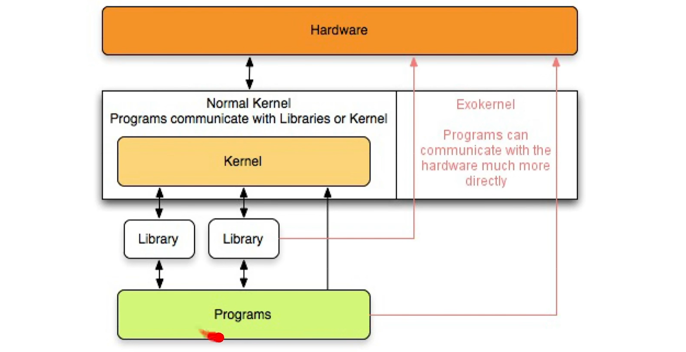

* **特点与思想**：

  - 外核设计理念是**将硬件资源的管理权交给用户态进程**，内核只负责进程调度和进程间通信，而不会抽象出统一的硬件接口。

  - 应用程序可以**直接管理硬件资源**，提高系统效率和灵活性。

* **优点**： 
  * ✅ **性能极高**：不抽象硬件，允许用户进程直接访问硬件，提高执行效率。
  * ✅ **灵活性强**：不同的应用程序可以根据自身需求定制资源管理策略，而不是受操作系统统一管理。

* **缺点**：
  *  ❌ **降低了系统的一致性**：由于不同应用可以采用不同的资源管理方式，导致软件兼容性问题。
  * ❌ **系统设计更加复杂**：缺乏统一的资源管理机制，应用程序开发者需要自行管理底层资源。

#### *总结对比：*

| 结构                  | **特点**                         | **优点**                 | **缺点**                     |
| --------------------- | -------------------------------- | ------------------------ | ---------------------------- |
| **分层结构**          | 按层次划分，每层只能调用下一层   | 结构清晰、易维护         | 层次限制严格，跨层调用开销大 |
| **模块化**            | 允许动态加载模块                 | 高扩展性，支持模块热插拔 | 模块依赖复杂，测试难度大     |
| **宏内核（大内核）**  | 所有功能都在内核态               | 高效，模块间可直接调用   | 代码庞大，稳定性较差         |
| **微内核（小内核）**  | 仅核心功能在内核态，其余在用户态 | 稳定性高，易扩展         | 频繁消息传递，性能开销大     |
| **外核（Exokernel）** | 应用程序直接管理硬件             | 极高性能，极大灵活性     | 降低一致性，开发复杂         |

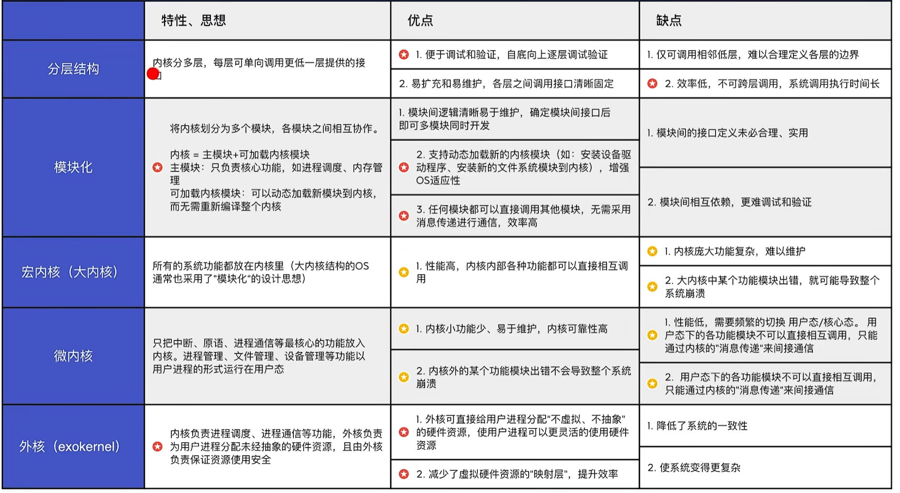

<***应用 >：***

- **宏内核（Monolithic Kernel）** 适用于对**性能要求高**的系统，如 Linux 和传统 Unix。
- **微内核（Microkernel）** 适用于**安全性、稳定性要求高**的场景，如 QNX、Minix。
- **外核（Exokernel）** 适用于**极端高性能需求**的场景，如科研和嵌入式系统。
- **模块化设计** 可以增强灵活性，很多现代操作系统（如 Linux）也部分采用模块化理念。

 

***

## 六、操作系统引导

> ***<扩展>：***将一个磁盘安装操作系统并分好盘符之后：
>
> 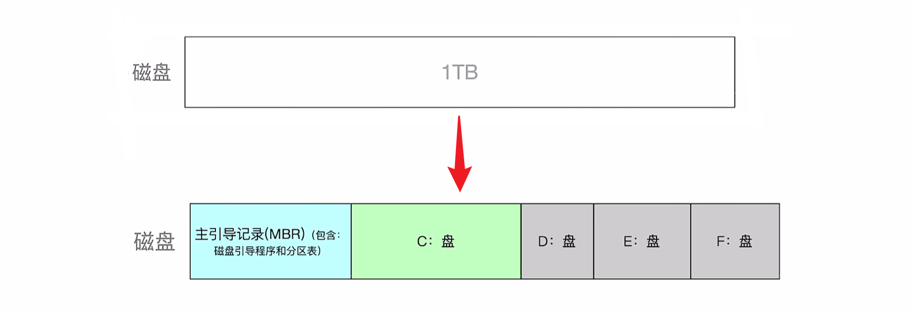

* 电脑开机，启动操作系统的流程图：  
  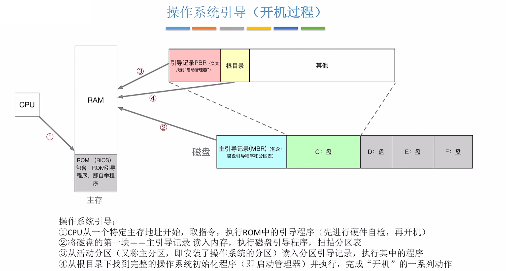
  * **RAM（随机存取存储器，Random Access Memory）**
    RAM是一种**易失性**存储器，用于存储计算机当前运行的程序和数据。其特点是**读写速度快**，但**断电后数据会丢失**。常见类型包括 **DRAM（动态RAM）** 和 **SRAM（静态RAM）**。
  * **ROM（只读存储器，Read-Only Memory）**
    ROM是一种**非易失性**存储器，用于存储**不可更改或只能少量修改的固件**（如计算机BIOS）。其特点是**断电后数据不会丢失**，但**读写速度比RAM慢**。常见类型包括 **EPROM、EEPROM 和 Flash ROM**。

***

## 七、虚拟机

### **7.1 为什么要使用虚拟机？**

随着计算机技术的发展，传统的物理机运行方式存在诸多问题，例如：

- **资源利用率低**：物理服务器往往无法充分利用其硬件资源，造成浪费。
- **环境依赖性强**：不同的操作系统和应用程序可能对硬件配置有特定要求，难以兼容。
- **管理和维护复杂**：服务器的部署、迁移、扩展等操作较为繁琐，成本高。

虚拟机（Virtual Machine, VM）技术通过**在一台物理机上模拟多个独立的计算机环境**，可以提高资源利用率、增强系统隔离性，并提供更灵活的管理方式。

### **7.2 什么是虚拟机？**

虚拟机是一种通过软件模拟计算机硬件的技术，它可以在**一台物理机上运行多个独立的操作系统**，相互之间**隔离**，但共享物理资源。

- **虚拟机由虚拟化层（VMM，虚拟机管理器）提供支持**，其核心作用是**在底层硬件和上层操作系统之间提供抽象**，让不同的操作系统可以在同一台设备上独立运行。

### **7.3 第一类虚拟机（Type-1 虚拟机）——裸金属（Hypervisor）**

**定义**：
第一类虚拟机（Type-1 虚拟机）直接运行在**物理硬件之上**，不依赖于宿主操作系统，虚拟机管理程序（Hypervisor）直接控制底层硬件，并在其上运行多个虚拟机。

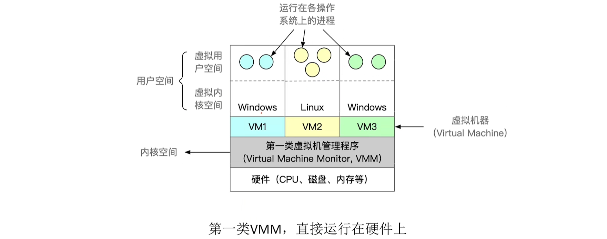

**特点**：

- **性能较高**：直接运行在硬件上，无需依赖宿主操作系统，减少了中间层开销。
- **资源管理能力强**：可以高效地管理 CPU、内存、存储和网络等硬件资源。
- **更适用于服务器虚拟化**：广泛应用于数据中心、云计算环境。

**常见的第一类虚拟机管理程序**：

- **VMware ESXi**
- **Microsoft Hyper-V**
- **KVM（Kernel-based Virtual Machine）**
- **Xen**

### **7.4 第二类虚拟机（Type-2 虚拟机）——宿主式（Hosted）**

**定义**：
第二类虚拟机（Type-2 虚拟机）运行在**宿主操作系统之上**，虚拟机管理程序作为一个普通的软件应用程序运行，并在其上创建虚拟机。

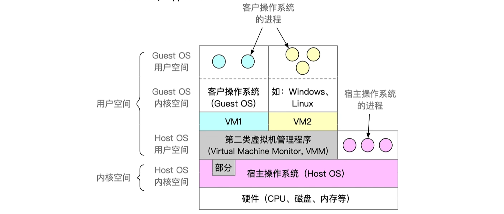

**特点**：

- **安装方便**：可以像普通应用软件一样安装，无需直接接触底层硬件。
- **灵活性高**：适用于个人用户在已有系统上运行不同操作系统（如在 Windows 运行 Linux）。
- **性能较低**：由于依赖于宿主操作系统，虚拟机的性能受限于宿主系统的调度。

**常见的第二类虚拟机管理程序**：

- **VMware Workstation / Fusion**
- **Oracle VirtualBox**
- **Parallels Desktop（用于 macOS）**

### **7.5 第一类 vs. 第二类虚拟机对比**

| 特性     | 第一类虚拟机（Type-1）    | 第二类虚拟机（Type-2）         |
| -------- | ------------------------- | ------------------------------ |
| 运行方式 | 直接运行在物理硬件上      | 依赖于宿主操作系统             |
| 性能     | 高，接近物理机            | 低，中间层开销较大             |
| 适用场景 | 服务器虚拟化、云计算      | 个人用户、测试开发环境         |
| 资源管理 | 强，可高效调度硬件资源    | 较弱，受宿主系统影响           |
| 代表软件 | VMware ESXi、KVM、Hyper-V | VMware Workstation、VirtualBox |

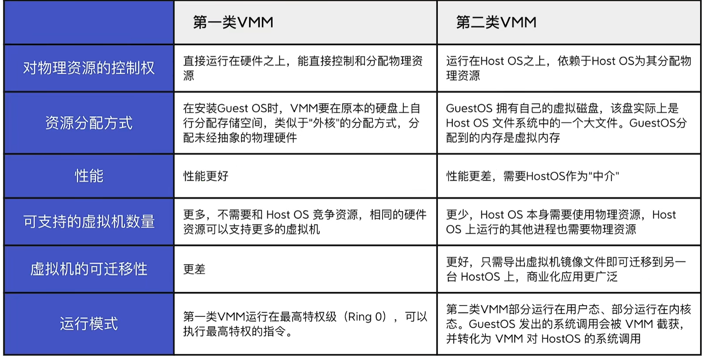

### **7.6 总结**

虚拟机技术在计算机领域起到了**提升资源利用率、增强系统隔离性、提高灵活性**的重要作用。

- **第一类虚拟机** 适用于企业级数据中心、云计算平台，提供高性能和高资源管理能力。
- **第二类虚拟机** 适用于个人用户和开发测试环境，安装简便但性能受限。
  随着虚拟化技术的不断发展，虚拟机已成为现代计算机体系结构中的重要组成部分
